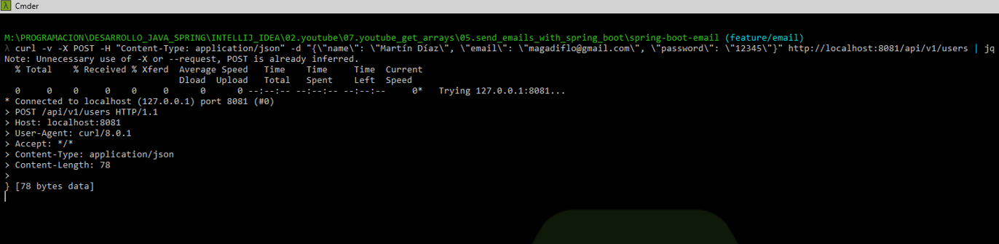
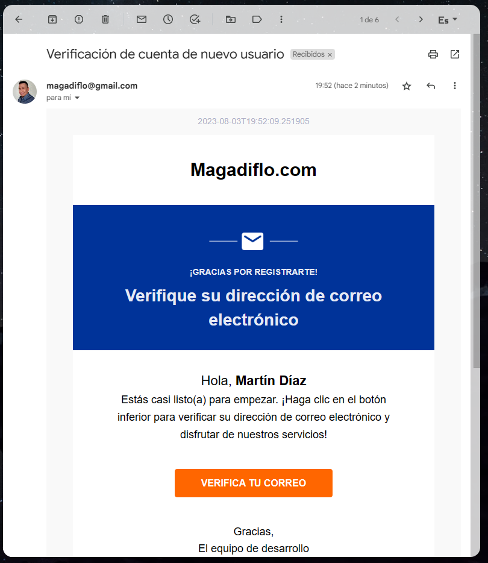

# [Send Emails with Spring Boot](https://www.youtube.com/watch?v=onCzCxDyR24)

Tutorial tomado del canal de [Get Arrays](https://www.youtube.com/watch?v=onCzCxDyR24)

--- 

## Creando Aplicación de Spring Boot

Las dependencias agregadas al proyecto desde su creación en Spring Initializr son la siguientes:

````xml
<!-- Spring Boot 3.1.2 y Java 17-->
<dependencies>
    <dependency>
        <groupId>org.springframework.boot</groupId>
        <artifactId>spring-boot-starter-data-jpa</artifactId>
    </dependency>
    <dependency>
        <groupId>org.springframework.boot</groupId>
        <artifactId>spring-boot-starter-mail</artifactId>
    </dependency>
    <dependency>
        <groupId>org.springframework.boot</groupId>
        <artifactId>spring-boot-starter-thymeleaf</artifactId>
    </dependency>
    <dependency>
        <groupId>org.springframework.boot</groupId>
        <artifactId>spring-boot-starter-web</artifactId>
    </dependency>

    <dependency>
        <groupId>org.postgresql</groupId>
        <artifactId>postgresql</artifactId>
        <scope>runtime</scope>
    </dependency>
    <dependency>
        <groupId>org.projectlombok</groupId>
        <artifactId>lombok</artifactId>
        <optional>true</optional>
    </dependency>
    <dependency>
        <groupId>org.springframework.boot</groupId>
        <artifactId>spring-boot-starter-test</artifactId>
        <scope>test</scope>
    </dependency>
</dependencies>
````

El nombre de la clase principal creada por defecto es ``SpringBootEmailApplication``, lo renombramos a un nombre más
corto ``Main``, lo mismo haremos con la clase principal de Test ``MainTests``.

## User Domain Model

Para el propósito de esta aplicación necesitamos registrar usuarios en la base de datos a quienes luego de registrarse
en nuestra aplicación le tenemos que enviar un email para que confirme su registro. Por lo tanto, necesitamos crear la
clase **User** que será nuestro **Entity** que estará mapeado a una tabla de la base de datos.

````java

@AllArgsConstructor
@NoArgsConstructor
@SuperBuilder
@Setter
@Getter
@Entity
@Table(name = "users")
public class User {
    @Id
    @GeneratedValue(strategy = GenerationType.AUTO)
    private Long id;
    private String name;
    private String email;
    private String password;
    private boolean isEnabled;
}
````

## Confirmation Domain Model

Necesitamos una entidad que almacene la confirmación del usuario. Para ser más exactos que almacene el token que se le
enviará, de tal forma que usaremos ese token para validar su confirmación. Entonces, crearemos una entity llamada
**Confirmation**:

````java

@NoArgsConstructor
@Setter
@Getter
@Entity
@Table(name = "confirmations")
public class Confirmation {
    @Id
    @GeneratedValue(strategy = GenerationType.AUTO)
    private Long id;
    private String token;

    @Temporal(TemporalType.TIMESTAMP)   // (1)
    @CreatedDate                        // (2)
    private LocalDateTime createdDate;

    @OneToOne(targetEntity = User.class, fetch = FetchType.EAGER) // (3)
    @JoinColumn(name = "user_id", nullable = false)
    private User user;

    public Confirmation(User user) {
        this.user = user;
        this.createdDate = LocalDateTime.now(); // (2.1)
        this.token = UUID.randomUUID().toString();
    }
}
````

En el código anterior, el tutor usa algunas anotaciones donde vale la pena aclarar algunas de ellas:

### (1) @Temporal(TemporalType.TIMESTAMP)

Según la definición de la anotación **@Temporal():** ``Esta anotación debe especificarse para campos persistentes o
propiedades de tipo java.util.Date y java.util.Calendar. Solo se puede especificar para campos o propiedades de este
tipo.``

Además, para campos del tipo **LocalDateTime en Java, no necesitamos la anotación "@Temporal"**, ya que **LocalDateTime
es una clase de fecha y hora** sin información de zona horaria que **se puede mapear directamente a una columna
TIMESTAMP en la base de datos.**

Por lo tanto, **yo quitaré dicha anotación**, ya que **la propiedad createdDate** al ser del tipo LocalDateTime **se
mapeará automáticamente a la columna "created_date" del tipo TIMESTAMP en la base de datos.**

Recordar que si definimos una propiedad del tipo camelCase en nuestra clase de entidad java, ejemplo: createdDate, su
equivalente como columna en la base de datos sería "created_date" definido por defecto por Hibernate. Podemos usar la
anotación @Column, para cambiar el nombre si quisiéramos.

### (2) @CreatedDate

Es una anotación que se utiliza en combinación con otras anotaciones **para realizar auditoría.**
Esta anotación **se utiliza para marcar un campo de una entidad como la fecha en la que se creó el registro en la base
de datos.** Cuando se guarda por primera vez una nueva instancia de la entidad, **Spring Data Jpa AUTOMÁTICAMENTE
establecerá el valor del campo anotado con @CreatedDate en la fecha y hora actuales.**

**La anotación @CreatedDate por sí sola no funcionará** de forma automática para establecer la fecha de creación de un
objeto. **Requiere algunas configuraciones adicionales para que funcione correctamente,** como configurar la auditoría
con la anotación **@EnableJpaAuditing**, extender la entidad con clases base de auditoría. **Es imprescindible añadir la
anotación @EnableJpaAuditing para que Spring Boot reconozca las anotaciones de auditoría para nuestra Base de Datos.**

Por lo tanto, como es una anotación orientada a la auditoría, en nuestro caso no será necesario utilizarlo, ya que
para poblar el campo **createdDate** lo haremos manualmente, dentro del constructor que tiene el parámetro del usuario:
**(2.1)** ``this.createdDate = LocalDateTime.now();``.

### Asociación Unidireccional @OneToOne

En el punto **(3)** observamos que la anotación @OneToOne tiene la propiedad **fetch = FetchType.EAGER**. Cuando una
anotación termina en **..One**, por defecto el fetch será del tipo **EAGER**, así que en nuestro caso no lo colocaremos
ya que por defecto lo es.

Otra propiedad que está definida dentro de la anotación @OneToOne es el **targetEntity = User.class**. La definición
dice: ``La clase de entidad que es el destino de la asociación. El valor predeterminado es el tipo de campo o
propiedad que almacena la asociación.``

**targetEntity = User.class:** Este atributo se utiliza para **especificar la clase de destino con la que se establecerá
la relación.** En este caso, la entidad User.class será la otra entidad que se relacionará con la entidad Confirmation
mediante la relación uno a uno.

Por lo tanto, en nuestro caso no es **necesario definir dicho atributo**, ya que JPA/Hibernate utilizará el tipo del
atributo user para inferir la entidad objetivo, que es User en este caso.

### Clase de dominio Confirmation

Finalmente, luego de haber quitado algunas anotaciones y atributos que por defecto se establecen o que en nuestro
caso no requerimos, mi clase de dominio **Confirmation** quedaría de la siguiente manera:

````java

@NoArgsConstructor
@Setter
@Getter
@Entity
@Table(name = "confirmations")
public class Confirmation {
    @Id
    @GeneratedValue(strategy = GenerationType.AUTO)
    private Long id;
    private String token;
    private LocalDateTime createdDate;

    @OneToOne
    @JoinColumn(name = "user_id", nullable = false)
    private User user;

    public Confirmation(User user) {
        this.user = user;
        this.createdDate = LocalDateTime.now();
        this.token = UUID.randomUUID().toString();
    }
}
````

## User Repository

````java
public interface IUserRepository extends JpaRepository<User, Long> {
    Optional<User> findByEmailIgnoreCase(String email);

    Boolean existsByEmail(String email);
}
````

## Confirmation Repository

````java
public interface IConfirmationRepository extends JpaRepository<Confirmation, Long> {
    Optional<Confirmation> findByToken(String token);
}
````

## User Service

Crearemos la interfaz **IUserService**:

````java
public interface IUserService {
    User saveUser(User user);

    Boolean verifyToken(String token);
}
````

Creamos la implementación de la interfaz anterior quien agrupará los dos repositorios que creamos inicialmente.
Antes de registrar al usuario, se hacen ciertas validaciones y se establece el valor de la propiedad **enabled** en
falso.

En el método **verify()** una vez verificado el token, establecemos la propiedad del usuario **enabled** en true, de
esta manera el usuario queda habilitado en el sistema.

````java

@RequiredArgsConstructor
@Service
public class UserServiceImpl implements IUserService {

    private final IUserRepository userRepository;
    private final IConfirmationRepository confirmationRepository;

    @Override
    @Transactional
    public User saveUser(User user) {
        if (this.userRepository.existsByEmail(user.getEmail())) {
            throw new RuntimeException(String.format("El email %s ya existe", user.getEmail()));
        }

        user.setEnabled(false);
        this.userRepository.save(user);

        Confirmation confirmation = new Confirmation(user);
        this.confirmationRepository.save(confirmation);

        // TODO enviar email a usuario con token

        return user;
    }

    @Override
    @Transactional
    public Boolean verifyToken(String token) {
        return this.confirmationRepository.findByToken(token)
                .map(confirmationDB -> {

                    String email = confirmationDB.getUser().getEmail();
                    User userDB = this.userRepository.findByEmailIgnoreCase(email)
                            .orElseThrow(() -> new RuntimeException(String.format("No existe el email %s", email)));

                    userDB.setEnabled(true);
                    this.userRepository.save(userDB);
                    this.confirmationRepository.delete(confirmationDB);

                    return Boolean.TRUE;
                })
                .orElseGet(() -> Boolean.FALSE);
    }
}
````

## User Resource

Antes de implementar el recurso de usuario, vamos a crear una clase que sea común a todas las respuestas que se manden
desde el backend:

````java

@JsonInclude(JsonInclude.Include.NON_DEFAULT)   // (1)
@SuperBuilder                                   // (2)
@Data
public class HttpResponse {
    protected String timeStamp;
    protected int statusCode;
    protected HttpStatus status;
    protected String message;
    protected String developerMessage;
    protected String path;
    protected String requestMethod;
    protected Map<?, ?> data;
}
````

De esta clase es importante aclarar algunas anotaciones:

### (1) @JsonInclude(JsonInclude.Include.NON_DEFAULT)

Se puede usar para excluir las propiedades con valores predeterminados de POJO.

**Si se usa @JsonInclude(JsonInclude.Include.NON_DEFAULT) en el nivel de clase, se excluyen los valores predeterminados
de los campos.** Esto se hace creando una instancia de POJO utilizando un constructor de cero argumentos y comparando
los valores de propiedad, excluyendo los que tienen valores predeterminados, **por ejemplo, el valor int predeterminado
es 0, el valor de String predeterminado es nulo y así sucesivamente.**

Por ejemplo:

````java

@JsonInclude(JsonInclude.Include.NON_DEFAULT)
public class Employee {
    private String name;
    private String dept;
    private Integer salary;
    private boolean fullTime;
    private List<String> phones;
    private Date dateOfBirth;
    /* other code */
}
````

````java
public class ExampleMain {
    public static void main(String[] args) throws IOException {
        Employee employee = new Employee();
        employee.setName("Trish");
        employee.setFullTime(false);
        employee.setPhones(new ArrayList<>());
        employee.setSalary(Integer.valueOf(0));
        employee.setDateOfBirth(new Date(0));

        ObjectMapper om = new ObjectMapper();
        String jsonString = om.writeValueAsString(employee);
        System.out.println(jsonString);
    }
}
````

El resultado sería:

````json
{
  "name": "Trish",
  "salary": 0,
  "phones": [],
  "dateOfBirth": 0
}
````

Como se ha visto en la salida anterior, **solo se excluyeron las propiedades con valores de miembro predeterminados.**
No se excluye el Integer con 0 (primitive wrapper - salary), ya que su valor predeterminado sería null y no 0, no se
excluye la fecha con 0 milisegundos y tampoco se excluye la colección "vacía" (teléfonos). Pero sí se excluye el
departamento, porque al no ser definido su valor, por defecto es nulo, también se excluye la propiedad
fullTime, porque al ser un primitivo booleano, su valor predeterminado es **false** y cuando creamos el objeto le
estamos asignando **false**, su valor predeterminado.

### (2) @SuperBuilder

Nos permite la creación de objetos mediante el patrón de diseño **Builder**. Esta anotación es similar a la anotación
**@Builder**, también de Lombok, pero con una diferencia.

Cuando se coloca la anotación **@Builder** en una clase, Lombok genera un constructor privado con todos los campos de la
clase y un método estático público llamado builder() que devuelve una instancia del Builder. Este Builder se utiliza
para configurar selectivamente los campos de la clase y, finalmente, crear una instancia de la clase llamando al método
build(). **Es útil cuando solo necesitas crear una clase con el patrón de diseño Builder, sin la necesidad de heredar de
una clase base con sus propios campos.**

Ahora, **@SuperBuilder es una extensión de @Builder.** Además de generar el Builder para la clase anotada, también
**tiene en cuenta la herencia.** Cuando una clase utiliza @SuperBuilder, el Builder generado tiene métodos para
configurar tanto los campos de la clase actual como los campos heredados de la clase base. Esto **permite construir
objetos de la clase derivada junto con sus campos heredados.**

Es útil cuando tienes una jerarquía de clases y deseas construir objetos de clases derivadas utilizando el patrón de
diseño Builder.

Cuando todas las clases están anotadas con **@SuperBuilder**, obtenemos un constructor para la clase secundaria que
también expone las propiedades de los padres.

**Tenga en cuenta que tenemos que anotar todas las clases.** @SuperBuilder no se pueden mezclar con @Builder dentro de
la misma jerarquía de clases. Si lo hace, se producirá un error de compilación.

Ahora sí, creamos nuestro recurso de usuario donde implementamos dos end points:

````java

@RequiredArgsConstructor
@RestController
@RequestMapping(path = "/api/v1/users")
public class UserResource {

    private final IUserService userService;

    @PostMapping
    public ResponseEntity<HttpResponse> createUser(@RequestBody User user) {
        User userDB = this.userService.saveUser(user);
        URI uriUser = URI.create("");
        HttpResponse httpResponse = HttpResponse.builder()
                .timeStamp(LocalDateTime.now().toString())
                .data(Map.of("user", userDB))
                .message("Usuario creado")
                .statusCode(HttpStatus.CREATED.value())
                .status(HttpStatus.CREATED)
                .build();
        return ResponseEntity.created(uriUser).body(httpResponse);
    }

    @GetMapping
    public ResponseEntity<HttpResponse> confirmUserAccount(@RequestParam String token) {
        Boolean isSuccess = this.userService.verifyToken(token);
        HttpResponse httpResponse = HttpResponse.builder()
                .timeStamp(LocalDateTime.now().toString())
                .data(Map.of("success", isSuccess))
                .message("Cuenta verificada")
                .statusCode(HttpStatus.OK.value())
                .status(HttpStatus.OK)
                .build();
        return ResponseEntity.ok(httpResponse);
    }
}
````

## Configuración de la base de datos

Cambiamos el ``application.properties`` por ``application.yml`` y agregamos las siguientes configuraciones:

````yaml
server:
  port: ${SERVER_PORT}

spring:
  profiles:
    active: ${ACTIVE_PROFILE:dev}

  datasource:
    url: jdbc:postgresql://${POSTGRES_SQL_HOST}:${POSTGRES_SQL_PORT}/${POSTGRES_SQL_DB}
    username: ${POSTGRES_SQL_USERNAME}
    password: ${POSTGRES_SQL_PASSWORD}

  jpa:
    generate-ddl: true
    show-sql: true
    hibernate:
      ddl-auto: update
    properties:
      hibernate:
        jdbc:
          time_zone: America/Lima
        globally_quoted_identifiers: true
        dialect: org.hibernate.dialect.PostgreSQLDialect
        format_sql: true
````

Según se menciona en el tutorial, esta configuración es muy exagerada para el pequeño proyecto que estamos realizando,
pero se hace de esta manera para tener una idea de cómo se realizan las configuraciones en aplicaciones grandes y
desde ya ir adaptándonos.

En las configuraciones tenemos la propiedad **spring.profiles.active** se utiliza para especificar qué perfil (o
perfiles) se debe activar cuando la aplicación se inicie. En nuestro caso utilizamos el siguiente valor para esa
configuración:

````yaml
${ACTIVE_PROFILE:dev}
````

Esta es una notación de expresión que se utiliza para **proporcionar un valor predeterminado en caso de que la variable
de entorno ACTIVE_PROFILE no esté definida.** En este caso, si no se proporciona un valor para ACTIVE_PROFILE, se
utilizará **el perfil dev como valor predeterminado.**

Ahora, también hemos definido otras variables de entorno que no tienen valor predeterminado, tales como:

````yaml
${SERVER_PORT}
${POSTGRES_SQL_USERNAME}
${POSTGRES_SQL_PASSWORD}
${POSTGRES_SQL_HOST}
${POSTGRES_SQL_PORT}
${POSTGRES_SQL_DB}
````

Otra configuración que vale la pena mencionar es la siguiente:

````properties
spring.jpa.properties.hibernate.globally_quoted_identifiers=true
````

Se utiliza para indicar que se deben citar globalmente los identificadores (nombres de tablas y columnas) en las
consultas SQL generadas por Hibernate. Esto significa que todos los nombres de tablas y columnas se incluirán entre
comillas en las consultas SQL generadas, lo que es útil cuando se trabaja con bases de datos que requieren que los
identificadores sean citados.

Con esta configuración, las consultas SQL generadas por Hibernate se verían así:

````roomsql
SELECT `MiEntidad`.`MiColumna` FROM `MiEntidad`;
````

De esta manera, la base de datos entenderá que los nombres de tablas y columnas están citados y procesará las consultas
correctamente.

### Creando perfiles de configuración

Cuando trabajemos en una aplicación grande, por lo general, tendremos distintos entornos donde ejecutaremos nuestra
aplicación: **dev, test, prod** entre otros. Nuestra aplicación debe tener la configuración según el entorno donde será
ejecutado. En nuestro caso tenemos un archivo principal llamado ``application.properties`` donde estamos definiendo
la configuración de la conexión a la base de datos. Esta configuración se establece de manera genérica, utilizando
variables de entorno, de tal forma que, según el ambiente donde sea ejecutado, definiremos los valores para dichas
variables de entorno.

En la raíz del proyecto creamos el perfil para desarrollo: ``application-dev.yml``:

````yaml
#Database
POSTGRES_SQL_USERNAME: postgres
POSTGRES_SQL_PASSWORD: magadiflo
POSTGRES_SQL_HOST: 127.0.0.1
POSTGRES_SQL_PORT: 5432
POSTGRES_SQL_DB: db_spring_boot_email

#Server
SERVER_PORT: 8081
ACTIVE_PROFILE: dev
````

Ahora creamos el perfil para pruebas: ``application-test.yml``

````yaml
#Database
POSTGRES_SQL_USERNAME: postgres
POSTGRES_SQL_PASSWORD: magadiflo
POSTGRES_SQL_HOST: 127.0.0.1
POSTGRES_SQL_PORT: 5432
POSTGRES_SQL_DB: db_test

#Server
SERVER_PORT: 8082
ACTIVE_PROFILE: test
````

Ahora creamos el perfil para producción: ``application-prod.yml``

````yaml
#Database
POSTGRES_SQL_USERNAME: postgres
POSTGRES_SQL_PASSWORD: magadiflo
POSTGRES_SQL_HOST: 127.0.0.1
POSTGRES_SQL_PORT: 5432
POSTGRES_SQL_DB: db_production

#Server
SERVER_PORT: 8083
ACTIVE_PROFILE: prod
````

El archivo por defecto que contiene todas las configuraciones es el ``application.yml``, ahora si queremos definir un
perfil, ya sea **dev, test, prod** o cualquier otro, lo único que haremos será crear con el mismo nombre del archivo
por defecto, agregándole con un guion (-) el perfil que queremos ``application-{nombre_perfil}.properties`` o
``application-{nombre_perfil}.yml``, por ejemplo:

````
# Perfiles

application.yml       (por default)

application-dev.yml   (para desarrollo)
application-test.yml  (para pruebas)
application-prod.yml  (para producción)
````

Ahora, como podemos observar **en cada perfil definimos el valor de las variables de entorno** que se aplicarán a
nuestro archivo por defecto (application.yml). Además, **en cada archivo de configuración específico del perfil, podemos
colocar las propiedades que deseemos personalizar para ese entorno.** Podemos sobrescribir las propiedades del archivo
application.yml o agregar nuevas específicas del perfil.

### Ejecutando perfil usando IntelliJ IDEA

Vamos a ver varias opciones para **ejecutar un perfil determinado usando IntelliJ IDEA**:

````
- Seleccionar Run/Edit Configurations...
- Seleccionamos la configuración de nuestra aplicación llamada: Main
````

Estando en este punto, podemos configurar el perfil de varias maneras. Suponiendo que queremos ejecutar el perfil test:

**Opción 1:** En el input **Environment variables** utilizar la variable de ambiente definida en el **application.yml**

> **Environment variables:** ACTIVE_PROFILE=test

**Opción 2:** En el input **Environment variables** utilizar la configuración de selección de perfil que usa spring
boot:

> **Environment variables:** spring.profiles.active=test

**Opción 3:** En esta opción no usaremos el **Environment variables**, sino que más bien iremos a la opción de
**Modify options** y seleccionaremos **Add VM options**. Nos aparecerá un nuevo input donde escribiremos lo siguiente:

> -Dspring.profiles.active=test

### Ejecutando perfil usando la consola de comandos

Para ejecutar nuestra aplicación seleccionando un perfil, debemos posicionarnos mediante cmd en la raíz del proyecto y
ejecutar el siguiente comando:

````bash
mvn spring-boot:run -Dspring-boot.run.profiles=test
````

Otra opción sería, si generamos el .jar de la aplicación y luego ejecutamos el perfil deseado:

````bash
mvnw clean package
````

````bash
java -jar -Dspring.profiles.active=test .\target\spring-boot-email-0.0.1-SNAPSHOT.jar 
````

````bash
java -jar -DACTIVE_PROFILE=test .\target\spring-boot-email-0.0.1-SNAPSHOT.jar 
````

**IMPORTANTE**

> Si no se especifica ningún perfil activo, Spring Boot utilizará las propiedades definidas en el archivo
> application.yml por defecto. Ahora, este archivo de configuración (que es el por default), en la configuración del
> **spring.profiles.active: ${ACTIVE_PROFILE:dev}** vemos que está usando una variable de entorno llamada
> ACTIVE_PROFILE, y como no especificaremos ningún perfil activo de manera explícita, dicha variable no existirá, por lo
> tanto, tomará el valor del **dev**, de esta manera **se activará el archivo del perfil application-dev.yml.**

## Prueba de humo

Utilizamos curl para hacer la petición a nuestro endpoint y registrar un usuario:

````bash
curl -v -X POST -H "Content-Type: application/json" -d "{\"name\": \"Karen Caldas\", \"email\": \"kasary@gmail.com\", \"password\": \"12345\"}" http://localhost:8081/api/v1/users | jq

--- Response
< HTTP/1.1 201
<
{
  "timeStamp": "2023-07-30T20:28:27.810846300",
  "statusCode": 201,
  "status": "CREATED",
  "message": "Usuario creado",
  "data": {
    "user": {
      "id": 252,
      "name": "Karen Caldas",
      "email": "kasary@gmail.com",
      "password": "12345",
      "enabled": false
    }
  }
}
````

Ahora, revisamos la base de datos para observar los resultados obtenidos:


Y por si quisiéramos ver la asociación generada en la base de datos:


---

# Email

## Creando contraseña de aplicación Gmail

Utilizaremos nuestro correo de Gmail para poder hacer el envío de correos, pero para no colocar nuestra contraseña real
necesitamos crear una **contraseña de aplicación**.

> Los pasos de la creación de una **Contraseña de Aplicación** para un correo de Gmail se encuentran en el siguiente
> enlace [Iniciar sesión con contraseñas de aplicación](https://support.google.com/accounts/answer/185833?hl=es). De
> todas maneras la colocaré aquí también:
>
> 1. Ve a tu [**cuenta de Google**](https://myaccount.google.com/).
> 2. Selecciona **Seguridad.**
> 3. En "Iniciar sesión en Google", selecciona **Verificación en dos pasos.**
> 4. En la parte inferior de la página, selecciona **Contraseñas de aplicaciones.**
> 5. En el select **seleccionar aplicación** elige **otra (nombre personalizado)** e introduce un nombre que te ayude a
     recordar dónde vas a utilizar la contraseña de aplicación.
> 6. Selecciona **Generar.**
> 7. Se mostrará la contraseña de aplicación generada de 16 caracteres, copiarla y no compartirla con nadie. Esta será
     la contraseña que usemos para enviar los correos desde nuestra aplicación de Spring Boot.
> 8. Selecciona **Hecho.**

## Configuración de Email

En nuestros archivos de configuración definiremos las siguientes variables relacionadas con nuestro servidor de correo
Gmail. Es importante precisar que estas variables de configuración los agregaremos a los distintos ambientes:
**application-dev.yml, application-test.yml, application-prod.yml** y dependiendo del ambiente a trabajar definiremos
sus valores. En nuestro caso, el mismo valor para todos, pero cuando se trabaje en un ambiente real, debemos cambiar
los valores por los que se usen en dicho ambiente:

````yaml
## Other properties

## Email Config
EMAIL_HOST: smtp.gmail.com
EMAIL_PORT: 587
EMAIL_ID: magadiflo@gmail.com
EMAIL_PASSWORD: qdonjimehiaemcku
VERIFY_EMAIL_HOST: http://localhost:${SERVER_PORT}
````

Ahora configuraremos el archivo de propiedad principal **application.yml (perfil default):**

````yaml
## Other properties

spring:
  # profiles
  # datasource
  # jpa

  mail:
    host: ${EMAIL_HOST}
    port: ${EMAIL_PORT}
    username: ${EMAIL_ID}
    password: ${EMAIL_PASSWORD}
    default-encoding: UTF-8
    properties:
      mail:
        mime:
          charset: UTF
        smtp:
          writetimeout: 10000       #10s ó 10000 ms
          connectiontimeout: 10000  #10s ó 10000 ms
          timeout: 10000            #10s ó 10000 ms
          auth: true
          starttls:
            enable: true
            required: true
    # Configuración propia personalizada
    verify:
      host: ${VERIFY_EMAIL_HOST}

````

La configuración anterior hace **uso de las variables que definimos en los perfiles de configuración** para configurar
todo lo relacionado con el servidor de mail que usaremos (Gmail).

La siguiente configuración extraída de la configuración anterior, **es personalizada, no es propia de spring.mail**,
pero nosotros podemos agregarlo sin problemas, nuestra configuración personalizada se vería de la siguiente manera
si usáramos la extensión .properties: ``spring.mail.verify.host = ${VERIFY_EMAIL_HOST}``, **es nuestra configuración
propia que posteriormente la usaremos dentro de la aplicación.**

````yml
spring:
  mail:
    # Configuración propia personalizada
    verify:
      host: ${VERIFY_EMAIL_HOST}
````

**NOTA**

> La configuración del servidor de correo también la podemos hacer usando una clase de java y utilizando las variables
> definidas en los archivos de configuración yml, pero según el tutor, es mejor utilizar el archivo de configuración.

## Email Service Interface

Creamos una interfaz que contendrá los métodos que abarcarán los escenarios posibles al enviar correos:

````java
public interface IEmailService {
    void sendSimpleMailMessage(String name, String to, String token);

    void sendMimeMessageWithAttachments(String name, String to, String token);

    void sendMimeMessageWithEmbeddedImages(String name, String to, String token);

    void sendMimeMessageWithEmbeddedFiles(String name, String to, String token);

    void sendHtmlEmail(String name, String to, String token);

    void sendHtmlEmailWithEmbeddedFiles(String name, String to, String token);
}
````

## Implementando el envío de email de texto simple

Creamos la clase de implementación de la interfaz creada anteriormente e implementamos de momento el primer método para
poder enviar un correo con texto simple:

````java

@RequiredArgsConstructor
@Service
public class EmailServiceImpl implements IEmailService {

    private final JavaMailSender javaMailSender;

    @Value("${spring.mail.verify.host}")
    private String host;
    @Value("${spring.mail.username}")
    private String fromEmail;

    @Override
    public void sendSimpleMailMessage(String name, String to, String token) {
        try {
            SimpleMailMessage message = new SimpleMailMessage();
            message.setSubject("Verificación de cuenta de nuevo usuario");
            message.setFrom(this.fromEmail);
            message.setTo(to);
            message.setText("Hola, la vicuña es del Perú. El token que se te generó es: " + token);

            this.javaMailSender.send(message);
        } catch (Exception e) {
            System.out.println(e.getMessage());
            throw new RuntimeException("Error SimpleMail: " + e.getMessage());
        }
    }

    /* other methods without implementation */
}
````

## Enviando email simple al registrar nuevo usuario

Luego de registrar a un usuario, le enviaremos un correo simple utilizando el método **sendSimpleMailMessage()** que
implementamos en la sección anterior.

En nuestro servicio **UserServiceImpl** debemos inyectar el servicio del email, para eso utilizamos la interfaz
**IEmailService** que en tiempo de ejecución tomará el valor de su implementación **EmailServiceImpl**. Dentro del
método **saveUser()** utilizamos **los datos del usuario registrado** y de la confirmación para hacer el envío del
correo:

````java

@RequiredArgsConstructor
@Service
public class UserServiceImpl implements IUserService {

    /* other injected services */
    private final IEmailService emailService;

    @Override
    @Transactional
    public User saveUser(User user) {
        /* other code */
        this.userRepository.save(user);

        Confirmation confirmation = new Confirmation(user);
        this.confirmationRepository.save(confirmation);

        // TODO enviar email a usuario con token
        this.emailService.sendSimpleMailMessage(user.getName(), user.getEmail(), confirmation.getToken());

        return user;
    }

    /* other method */
}
````

Levantamos la aplicación y realizamos una petición al endpoint para poder registrar un usuario:

````bash
curl -v -X POST -H "Content-Type: application/json" -d "{\"name\": \"Martín Díaz\", \"email\": \"magadiflo@gmail.com\", \"password\": \"12345\"}" http://localhost:8081/api/v1/users | jq

--- Response
HTTP/1.1 201
{
  "timeStamp": "2023-07-31T20:13:22.257878400",
  "statusCode": 201,
  "status": "CREATED",
  "message": "Usuario creado",
  "data": {
    "user": {
      "id": 302,
      "name": "Martín Díaz",
      "email": "magadiflo@gmail.com",
      "password": "12345",
      "enabled": false
    }
  }
}
````

Finalmente, revisamos el correo y verificamos que nos haya llegado el email:


## Email Utilities

Crearemos un nuevo package llamado **utils** donde agregaremos una clase de utilidad para la implementación de nuestro
servicio de email. Esta clase tendrá dos **métodos que podrán ser reutilizados, esa será su finalidad:**

````java
public class EmailUtils {
    public static String getEmailMessage(String name, String host, String token) {
        return "(Perú Vicuña) Hola " + name + ",\n\n" +
                "Tu nueva cuenta ha sido creada. " +
                "Por favor, haga clic en el enlace de abajo para verificar su cuenta" + "\n\n" +
                getVerificationUrl(host, token);
    }

    public static String getVerificationUrl(String host, String token) {
        return String.format("%s/api/v1/users?token=%s", host, token);
    }
}
````

En nuestra clase de implementación **EmailServiceImpl** utilizamos la clase de utilidad para poder generar el cuerpo del
mensaje de nuestro correo a enviar:

````java

@RequiredArgsConstructor
@Service
public class EmailServiceImpl implements IEmailService {
    /*other code*/
    @Override
    public void sendSimpleMailMessage(String name, String to, String token) {
        try {
            /*other code*/
            message.setText(EmailUtils.getEmailMessage(name, this.host, token)); //<-- Generando cuerpo del mensaje con nuestra clase de utilidad
            /*other code*/
        } catch (Exception e) {/*other code*/}
    }
}
````

Listo, ahora volvemos a ejecutar nuestra aplicación, y realizamos la petición para registrar un usuario:

````bash
curl -v -X POST -H "Content-Type: application/json" -d "{\"name\": \"Martín Díaz\", \"email\": \"magadiflo@gmail.com\", \"password\": \"12345\"}" http://localhost:8081/api/v1/users | jq

--- Response
HTTP/1.1 201
{
  "timeStamp": "2023-08-01T16:45:11.553094",
  "statusCode": 201,
  "status": "CREATED",
  "message": "Usuario creado",
  "data": {
    "user": {
      "id": 352,
      "name": "Martín Díaz",
      "email": "magadiflo@gmail.com",
      "password": "12345",
      "enabled": false
    }
  }
}
````

Verificamos que nos haya llegado el correo:


Verificamos que tengamos el usuario y su confirmación registrados en la base de datos, **pero en la columna
is_enabled debe estar en falso**, esperando que el usuario haga la verificación de su cuenta:


Ahora, **hacemos clic en el enlace proporcionado en el correo de verificación**, esto nos llevará a la siguiente página
con la obtención del siguiente resultado:


El resultado anterior muestra el funcionamiento de nuestro endpoint ``/api/v1/users`` que está esperando recibir un
parámetro llamado ``token``, ese endpoint corresponde al método handler **confirmUserAccount()** de nuestro rest
controller **UserResource**.

Entonces, cuando se hizo clic en el enlace de verificación se puso en funcionamiento el endpoint para verificar la
cuenta del usuario, eso significa que **nuestra base de datos también fue modificada** cambiando el valor de la columna
**is_enabled** en **true** y eliminando todo el registro del token de la tabla **confirmations**:


## Experimentando demora al registrar un usuario

Veamos lo que ocurre cuando realizamos una petición al endpoint para registrar un usuario, sabemos que luego de que nos
registre en la base de datos, enviará un correo de verificación:



En la imagen anterior observamos que se está realizando la petición el endpoint de registro de usuario
**tomándole APROXIMADAMENTE 5 SEGUNDOS en obtener la respuesta** que se muestra en la imagen inferior:


Lo que está pasando es lo siguiente, luego de que el cliente hace la petición al endpoint de registro de usuario, este
se mapea al método handler **createUser()**, este método llama al método **saveUser()** del servicio
**UserServiceImpl**. Veamos lo que contiene el método **saveUser()**:

````java

@RequiredArgsConstructor
@Service
public class UserServiceImpl implements IUserService {
    @Override
    @Transactional
    public User saveUser(User user) {
        if (this.userRepository.existsByEmail(user.getEmail())) {
            throw new RuntimeException(String.format("El email %s ya existe", user.getEmail()));
        }

        user.setEnabled(false);
        this.userRepository.save(user);                             // (1)

        Confirmation confirmation = new Confirmation(user);
        this.confirmationRepository.save(confirmation);             // (2)

        // TODO enviar email a usuario con token
        this.emailService.sendSimpleMailMessage(user.getName(), user.getEmail(), confirmation.getToken()); // (3)

        return user;    // (4)
    }
}
````

En el código anterior observamos que **el (1) user y el (2) confirmation se registran de manera casi instantánea** en la
base de datos, pero **cuando llega a la línea donde está el método (3) sendSimpleMailMessage()** es donde se experimenta
la demora, pues ese método se encarga de enviar el correo, y **mientras no termine su ejecución, el usuario ya
registrado aún no se devolverá al cliente (4).**

Para mejorar el comportamiento anterior, **haremos que los métodos de envío de correo sean asíncronos**, es decir,
**trabajen en un hilo separado del hilo que se creó con la solicitud**. Para eso utilizaremos la anotación:
**@Async**, la cual nos **permitirá procesar y ejecutar otros métodos en un nuevo thread.** Es decir, no vamos a tener
que esperar por la ejecución de la otra parte de nuestro código.

### [@Async](https://www.baeldung.com/spring-async)

El uso de @Async nos va a proporcionar y permitir la ejecución asíncrona en Spring, la cual es una técnica de
programación que permite el **procesamiento paralelo y separar la carga de trabajo del thread principal** creando nuevos
threads worker.

**Anotar un método de un "bean" con @Async hará que se ejecute en un hilo separado.** En otras palabras, la persona que
llama no esperará a que se complete el método llamado.

Repasemos las reglas. @Async tiene dos limitaciones:

- Debe aplicarse únicamente a métodos públicos.
- La auto-invocación (llamar al método asíncrono desde dentro de la misma clase) no funcionará.

Las razones son simples: el método debe ser público para que pueda ser redireccionado. Y la autoinvocación no funciona
porque omite el proxy y llama directamente al método subyacente.

### [@EnableAsync](https://www.baeldung.com/spring-async)

La anotación **@EnableAsync** nos permitirá **habilitar el procesamiento asíncrono** con la **configuración de java**.
Haremos esto agregando el **@EnableAsync a una clase de configuración:**

````java

@Configuration
@EnableAsync
public class SpringAsyncConfig {
    /*...*/
}
````

### [Métodos con tipo de retorno void](https://www.baeldung.com/spring-async)

Una de las formas de hacer **uso de @Async es invocando a un método que devolverá void**, de esta manera no esperamos
ningún resultado y el hilo principal no esperará resultado del worker thread.

Esta es la forma sencilla de configurar un método con tipo de retorno void para que se ejecute de forma asincrónica:

````java

@Component
public class AsyncComponent {
    @Async
    public void asyncMethodWithVoidReturnType() {
        System.out.println("Ejecutar método de forma asíncrona. " + Thread.currentThread().getName());
    }
}
````

### [Manejo de excepciones](https://www.baeldung.com/spring-async)

Cuando el tipo de retorno de un método es un **Future<>**, el manejo de excepciones es fácil. El método Future.get()
producirá la excepción.

Pero **si el tipo de retorno es void, las excepciones no se propagarán al subproceso de llamada.** Por lo tanto,
necesitamos agregar configuraciones adicionales para manejar las excepciones.

Crearemos un controlador de excepciones asincrónico personalizado implementando la interfaz
**AsyncUncaughtExceptionHandler**. El método **handleUncaughtException()** se invoca cuando hay excepciones asincrónicas
no detectadas:

````java
public class CustomAsyncExceptionHandler implements AsyncUncaughtExceptionHandler {
    @Override
    public void handleUncaughtException(Throwable throwable, Method method, Object... obj) {

        System.out.println("Exception message - " + throwable.getMessage());
        System.out.println("Method name - " + method.getName());
        for (Object param : obj) {
            System.out.println("Parameter value - " + param);
        }
    }
}
````

En el siguiente fragmento de código, observamos la interfaz AsyncConfigurer implementada por la clase de configuración.
Como parte de eso, también **necesitamos reemplazar el método getAsyncUncaughtExceptionHandler() para devolver nuestro
controlador de excepciones asincrónico personalizado:**

````java

@Configuration
@EnableAsync
public class SpringAsyncConfig implements AsyncConfigurer {
    @Override
    public AsyncUncaughtExceptionHandler getAsyncUncaughtExceptionHandler() {
        return new CustomAsyncExceptionHandler();
    }
}
````

**NOTA**
> **No confundir una aplicación asíncrona con una aplicación reactiva.**

## Mejorando el envío de email al registrar un nuevo usuario

En la sección anterior vimos el problema y cómo el uso de la anotación **@Async** nos ayuda a resolverlo. En esta
sección procederemos a su implementación.

Lo primero que realizaremos será crear una clase de configuración donde **habilitaremos el uso de la anotación @Async**.
``En el tutorial que sigo, el tutor habilita el uso de la anotación @Async en la clase principal`` sin crear ninguna
clase adicional. En mi caso, sí creo una clase de configuración, ya que revisando la web de **baeldung**, crean esta
clase de configuración para manejar las excepciónes en los métodos asíncronos.

````java

@EnableAsync //<-- Habilitamos el uso de la anotación @Async (soporte para métodos asíncronos)
@Configuration
public class SpringAsyncConfig {

}
````

Como segundo paso, es anotar los métodos void con **@Async**, en mi caso, anotaré todos los métodos que enviarán correo.
**Cada vez que un método anotado con @Async sea invocado se creará un nuevo Thread.**

````java

@RequiredArgsConstructor
@Service
public class EmailServiceImpl implements IEmailService {

    /*other code*/

    @Override
    @Async //<-- Anotación que marca un método como candidato para ejecución asíncrona.
    public void sendSimpleMailMessage(String name, String to, String token) {
        /* other code */
    }

    @Override
    @Async  //<--
    public void sendMimeMessageWithAttachments(String name, String to, String token) {
    }

    @Override
    @Async  //<--
    public void sendMimeMessageWithEmbeddedImages(String name, String to, String token) {
    }

    @Override
    @Async  //<--
    public void sendMimeMessageWithEmbeddedFiles(String name, String to, String token) {
    }

    @Override
    @Async  //<--
    public void sendHtmlEmail(String name, String to, String token) {
    }

    @Override
    @Async  //<--
    public void sendHtmlEmailWithEmbeddedFiles(String name, String to, String token) {
    }
}
````

Listo, ahora realizamos la petición nuevamente y veremos que **ya no se demora en retornar la respuesta, es casi de
inmediato.**


## Manejo de excepciones en los métodos anotados con @Async

**Este apartado no es parte del tutorial,** pero lo quise tratar por si en algún momento requiero implementar
validaciones a los métodos asíncronos. Antes de ver la implementación realizada, debemos conocer algunas definiciones
de las interfaces y métodos que usaremos:

### AsyncUncaughtExceptionHandler

Una estrategia para manejar excepciones no detectadas lanzadas desde métodos asincrónicos.

**Un método asíncrono generalmente devuelve una instancia java.util.concurrent.Future** que brinda acceso a la excepción
subyacente. **Cuando el método no proporciona ese tipo de valor devuelto**, este controlador se puede usar para
administrar tales **excepciones no detectadas.**

### handleUncaughtException()

Recibe parámetros de la excepción no detectada que fue lanzada desde un método asíncrono:

- ex – la excepción lanzada por el método asíncrono method
- method - el método asíncrono
- params - los parámetros usados para invocar el método

### AsyncConfigurer

Interfaz que implementarán las clases de @Configuration anotadas con @EnableAsync que deseen personalizar la instancia
de **Executor** utilizada al procesar invocaciones de métodos asincrónicos o la instancia
**AsyncUncaughtExceptionHandler** utilizada para procesar la excepción lanzada desde el método asincrónico con
**tipo de retorno void.**

## Implementando el manejo de excepciones en los métodos anotados con @Async

Ahora, vamos de lleno a implementar el manejo de excepciones. Primero crearemos un controlador de excepciones asíncrono
personalizado implementando la interfaz **AsyncUncaughtExceptionHandler**:

````java
public class CustomAsyncExceptionHandler implements AsyncUncaughtExceptionHandler {
    @Override
    public void handleUncaughtException(Throwable ex, Method method, Object... params) {
        System.out.println("Mensaje de excepción: " + ex.getMessage());
        System.out.println("Nombre del método: " + method.getName());
        for (Object param : params) {
            System.out.println("Valor del parámetro: " + param);
        }
    }
}
````

En nuestra clase de configuración que ya habíamos creado en capítulos anteriores implementaremos la interfaz
**AsyncConfigurer** y sobreescribiremos su método **getAsyncUncaughtExceptionHandler()** para retornar la clase de
configuración creada anteriormente:

````java

@EnableAsync
@Configuration
public class SpringAsyncConfig implements AsyncConfigurer {

    @Override
    public AsyncUncaughtExceptionHandler getAsyncUncaughtExceptionHandler() {
        return new CustomAsyncExceptionHandler();
    }
}
````

Listo, ahora ejecutamos la aplicación y realicemos una petición registrando un usuario, pero para observar el manejo
de la excepción **nos desconectaremos de internet** y veremos el comportamiento:

````bash
Mail server connection failed. Failed messages: com.sun.mail.util.MailConnectException: Couldn't connect to host, port: smtp.gmail.com, 587; timeout 10000;
  nested exception is:
	java.net.NoRouteToHostException: No route to host: no further information
Mensaje de excepción: Error SimpleMail: Mail server connection failed. Failed messages: com.sun.mail.util.MailConnectException: Couldn't connect to host, port: smtp.gmail.com, 587; timeout 10000;
  nested exception is:
	java.net.NoRouteToHostException: No route to host: no further information
Nombre del método: sendSimpleMailMessage
Valor del parámetro: Martín Díaz
Valor del parámetro: magadiflo@gmail.com
Valor del parámetro: 48f891c0-353e-481c-8423-4a6ae633217b
````

Como observamos, nuestro método **handleUncaughtException(...)** está mostrando las impresiones que definimos. Vemos que
el envío del correo no pudo efectuarse, eso podría ser registrado en el log. Pero, **si revisamos la base de datos, allí
sí tenemos registrado al usuario.**

## Importancia de manejar excepciones en métodos anotados con @Async

1. **Registros y monitoreo:** Si no se manejan las excepciones adecuadamente, es posible que las excepciones ocurridas
   en los métodos asíncronos no sean reportadas o registradas correctamente. Esto podría dificultar la identificación y
   solución de problemas en el sistema.

2. **Comportamiento inesperado:** Si una excepción no es manejada en un método asíncrono, el hilo de ejecución del
   método terminará abruptamente, lo que puede resultar en un comportamiento inesperado del programa o incluso en la
   pérdida de información importante.

3. **Procesos en segundo plano:** Los métodos asíncronos suelen utilizarse para realizar tareas en segundo plano, como
   enviar correos electrónicos, procesar tareas largas o ejecutar trabajos programados. Si no se manejan las excepciones
   adecuadamente, estas tareas en segundo plano podrían quedar incompletas o fallar silenciosamente.

4. **Salud del sistema:** Un fallo no manejado en un método asíncrono podría impactar negativamente en la salud general
   del sistema, especialmente si los errores no se reportan ni manejan adecuadamente.

## Enviando email con archivos adjuntos

En nuestra clase **EmailServiceImpl** implementamos el método **sendMimeMessageWithAttachments()** con el que enviaremos
archivos adjuntos. Además, debemos crear un método que nos retorne un **MimeMessage**, que **representa un mensaje de
correo electrónico de estilo MIME,** crearemos ese método para poder reutilizarlo. Veamos la implemetación realizada:

````java

@RequiredArgsConstructor
@Service
public class EmailServiceImpl implements IEmailService {
    /* other code */
    @Override
    @Async
    public void sendMimeMessageWithAttachments(String name, String to, String token) {
        try {
            MimeMessage message = this.getMimeMessage();
            MimeMessageHelper helper = new MimeMessageHelper(message, true, "UTF-8");
            helper.setPriority(1); //Establece la prioridad (encabezado "X-Priority") del mensaje. Entre 1(más alto) y 5 (más bajo)
            helper.setSubject("Verificación de cuenta de nuevo usuario");
            helper.setFrom(this.fromEmail);
            helper.setTo(to);
            helper.setText(EmailUtils.getEmailMessage(name, this.host, token));

            // Agregando archivos adjuntos
            FileSystemResource dog = new FileSystemResource(new File(System.getProperty("user.home") + "/Downloads/dog.jpg"));
            FileSystemResource programming = new FileSystemResource(new File(System.getProperty("user.home") + "/Downloads/programming.jpg"));
            FileSystemResource angular = new FileSystemResource(new File(System.getProperty("user.home") + "/Downloads/angular.pdf"));

            helper.addAttachment(dog.getFilename(), dog);
            helper.addAttachment(programming.getFilename(), programming);
            helper.addAttachment(angular.getFilename(), angular);

            this.javaMailSender.send(message);
        } catch (Exception e) {
            System.out.println(e.getMessage());
            throw new RuntimeException("Error SimpleMail: " + e.getMessage());
        }
    }

    private MimeMessage getMimeMessage() {
        return this.javaMailSender.createMimeMessage();
    }
}
````

Como observamos en la implementación anterior, estamos usando la clase **MimeMessageHelper, que es una clase auxiliar
para completar un MimeMessage.** Refleja los configuradores simples de org.springframework.mail.SimpleMailMessage,
aplicando directamente los valores al MimeMessage subyacente. Permite definir una codificación de caracteres para todo
el mensaje, aplicada automáticamente por todos los métodos de esta clase auxiliar. **Ofrece soporte para contenido de
texto HTML, elementos en línea como imágenes y archivos adjuntos de correo típicos.** También admite nombres personales
que acompañan a las direcciones de correo.

Para poder agregar los **archivos adjuntos (attachments)** utilizamos la clase **MimeMessageHelper** que utiliza un
**FileSystemResource de Spring** para poder adjuntar el recurso. En nuestro caso, adjuntaremos tres archivos: dos
imágenes + un archivo pdf.

Los archivos que se adjuntarán en el correo los coloqué en el directorio de descargas:

````
C:\Users\USUARIO\Downloads\dog.jpg
C:\Users\USUARIO\Downloads\programming.jpg
C:\Users\USUARIO\Downloads\angular.jpg
````


Ahora, en nuestra clase **UserServiceImpl** cambiamos el método **sendSimpleMailMessage()** que usámos anteriormente
para enviar correos simples, por nuestra nueva implementación:

````java

@RequiredArgsConstructor
@Service
public class UserServiceImpl implements IUserService {
    @Override
    @Transactional
    public User saveUser(User user) {
        /* other code*/

        // Enviando email a usuarios de forma asíncrona
        //this.emailService.sendSimpleMailMessage(user.getName(), user.getEmail(), confirmation.getToken());
        this.emailService.sendMimeMessageWithAttachments(user.getName(), user.getEmail(), confirmation.getToken());

        return user;
    }
}
````

Listo, ahora ejecutamos la aplicación y comprobaos que se hayan enviado nuestros tres archivos al correo:


## Enviando email con archivos embebidos

Implementamos nuestro método **sendMimeMessageWithEmbeddedFiles()** utilizando el método **addInline()**, este método
nos permite agregar un elemento en línea al MimeMessage, tomando el contenido de un
org.springframework.core.io.Resource.

````java

@RequiredArgsConstructor
@Service
public class EmailServiceImpl implements IEmailService {
    /* other code */
    @Override
    @Async
    public void sendMimeMessageWithEmbeddedFiles(String name, String to, String token) {
        try {
            MimeMessage message = this.getMimeMessage();
            MimeMessageHelper helper = new MimeMessageHelper(message, true, "UTF-8");
            helper.setPriority(1);
            helper.setSubject("Verificación de cuenta de nuevo usuario");
            helper.setFrom(this.fromEmail);
            helper.setTo(to);
            helper.setText(EmailUtils.getEmailMessage(name, this.host, token));

            // Agregando archivos adjuntos
            FileSystemResource dog = new FileSystemResource(new File(System.getProperty("user.home") + "/Downloads/dog.jpg"));
            FileSystemResource programming = new FileSystemResource(new File(System.getProperty("user.home") + "/Downloads/programming.jpg"));
            FileSystemResource angular = new FileSystemResource(new File(System.getProperty("user.home") + "/Downloads/angular.pdf"));

            helper.addInline(this.getContentId(dog.getFilename()), dog);
            helper.addInline(this.getContentId(programming.getFilename()), programming);
            helper.addInline(this.getContentId(angular.getFilename()), angular);

            this.javaMailSender.send(message);
        } catch (Exception e) {
            System.out.println(e.getMessage());
            throw new RuntimeException("Error SimpleMail: " + e.getMessage());
        }
    }

    private String getContentId(String filename) {
        return "<" + filename + ">";
    }
}
````

Si nos damos cuenta, lo único que estamos cambiando con referencia al método **sendMimeMessageWithAttachments()** son
los **helper.addAttachment()** por **helper.addInline()**. Como primer parámetro el **addInline()** requiere un
**contentId** que debe tener el formato ``<contentId>``, es por eso que creamos el método **getContentId()**.

Listo, iniciamos la aplicación y nos registramos. Esta vez lo haré enviando a un correo de gmail y de outlook para ver
cómo se ven en ambos servicios de correo:

GMAIL


OUTLOOK


Como vemos, el resultado es similar a la forma del envío de correos adjuntando archivos. Pero podemos notar una
diferencia, aquí no se muestra el nombre de los archivos. En **gmail** nos muestra **noname** mientras que en
**Outlook** nos muestra un código **ATT00003.pdf**. Si se mandan archivos, por ejemplo en Word, se muestra un
comportamiento extraño, como que no deja abrir (según se vio en el tutorial), mientras que si eso mismo se manda
utilizando el método de los **addAttachment()** sí se muestra correctamente.

## Enviando correo html

Enviaremos correo electrónico utilizando una plantilla html con soporte de thymeleaf. De esta manera enriquecemos el
correo que enviaremos. Lo primero que haremos será crear en el directorio **/resources/templates/** una plantilla html
que personalizaremos agregando datos dinámicamente con la ayuda de Thymeleaf.

``email-confirmation-template.html``

````html
<p style="font-size: 14px; line-height: 170%;"><span
        style="font-size: 14px; line-height: 23.8px;"
        th:text="${currentdate}"></span>
</p>
<p style="font-size: 14px; line-height: 160%;"><span
        style="font-size: 22px; line-height: 35.2px;">Hola, <strong
        th:text="${name}"></strong></span>
</p>
<a th:href="${url}" target="_blank" class="v-button">VERIFICA TU CORREO</a>
````

En el fragmento anterior observamos parte del html que usamos en la plantilla, gracias **al uso de Thymeleaf es que
podemos usar variables para poder agregar información a la plantilla de forma dinámica**, hasta el momento estas son las
variables que usamos junto a las instrucciones de thymeleaf:

````javascript
th:text="${currentdate}"
th:text="${name}"
th:href="${url}" 
````

Ahora, toca implementar el método que enviará el correo en html:

````java

@RequiredArgsConstructor
@Service
public class EmailServiceImpl implements IEmailService {
    /* other code */
    @Override
    @Async
    public void sendHtmlEmail(String name, String to, String token) {
        try {
            //------------ (1) Trabajando con html y Thymeleaf ------------------
            Context context = new Context();
            context.setVariables(Map.of(
                    "name", name,
                    "url", EmailUtils.getVerificationUrl(this.host, token),
                    "currentdate", LocalDateTime.now())
            );
            String text = templateEngine.process("email-confirmation-template", context);
            //-------------------------------------------------------------------

            MimeMessage message = this.getMimeMessage();
            MimeMessageHelper helper = new MimeMessageHelper(message, true, "UTF-8");
            helper.setPriority(1);
            helper.setSubject("Verificación de cuenta de nuevo usuario");
            helper.setFrom(this.fromEmail);
            helper.setTo(to);
            helper.setText(text, true); //<-- (2) True porque enviaremos texto en formato html

            this.javaMailSender.send(message);
        } catch (Exception e) {
            System.out.println(e.getMessage());
            throw new RuntimeException("Error SimpleMail: " + e.getMessage());
        }
    }
}
````

El código anterior es similar a los métodos de correo implementado en secciones anteriores, con la diferencia de que
en este método no se hace uso de archivos adjuntos. Si observamos bien, tan solo agregamos dos modificaciones:

- **(1)** definimos un contexto de Thymeleaf con el que agregaremos variables que se espera recibir en la plantilla
  html. Adicionalmente, realizamos una **inyección de dependencia** de la clase **TemplateEngine**. Esta es la clase
  principal para la ejecución de plantillas. **Esta es la única implementación de ITemplateEngine proporcionada por
  Thymeleaf.** Entonces, utilizamos el **TemplateEngine** para definir la plantilla html que usaremos, agregándole
  el contexto al que anteriormente le seteamos las variables.
- **(2)** al momento de utilizar nuestro **helper** para definir el texto del mensaje, le agregamos un segundo parámetro
  en true, **para decirle que el content type será "text/html"**, por defecto es "text/plain".

Finalmente en el **UserServiceImpl** cambiamos el método que ahora enviará los correos en html:

````java

@RequiredArgsConstructor
@Service
public class UserServiceImpl implements IUserService {
    @Override
    @Transactional
    public User saveUser(User user) {
        /* other code */

        // Enviando email a usuarios de forma asíncrona
        //this.emailService.sendSimpleMailMessage(user.getName(), user.getEmail(), confirmation.getToken());
        //this.emailService.sendMimeMessageWithAttachments(user.getName(), user.getEmail(), confirmation.getToken());
        //this.emailService.sendMimeMessageWithEmbeddedImages(user.getName(), user.getEmail(), confirmation.getToken());
        this.emailService.sendHtmlEmail(user.getName(), user.getEmail(), confirmation.getToken());
        return user;
    }
}
````

Listo, observamos el resultado:



## Enviar correo html con archivos incrustados

Si quisiéramos incrustar una imagen en la plantilla html de nuestro correo tendríamos que realizar una configuración
adicional a lo que hemos venido realizando.

Primero, definimos nuestra etiqueta **img** que recibirá la imagen:

````html

````

**DONDE**

- **cid**, significa Content-ID.
- **image**, nombre de la variable que mandaremos desde el código.

Ahora toca implementar el método que hará el envío del correo incrustando una imagen dentro del html del correo.

````java

@RequiredArgsConstructor
@Service
public class EmailServiceImpl implements IEmailService {
    @Override
    @Async
    public void sendHtmlEmailWithEmbeddedFiles(String name, String to, String token) {
        try {
            MimeMessage message = this.getMimeMessage();
            MimeMessageHelper helper = new MimeMessageHelper(message, true, "UTF-8");
            helper.setPriority(1);
            helper.setSubject("Verificación de cuenta de nuevo usuario");
            helper.setFrom(this.fromEmail);
            helper.setTo(to);
            //helper.setText(text, true); <-- Ya no se enviará de esta forma como en los anteriores métodos.

            Context context = new Context();
            context.setVariables(Map.of(
                    "name", name,
                    "url", EmailUtils.getVerificationUrl(this.host, token),
                    "currentdate", LocalDateTime.now())
            );
            String text = templateEngine.process("email-confirmation-template", context);

            MimeMultipart mimeMultipart = new MimeMultipart("related"); // (1)

            // Agrega el cuerpo del correo html
            BodyPart messageBodyPart = new MimeBodyPart();
            messageBodyPart.setContent(text, "text/html");
            mimeMultipart.addBodyPart(messageBodyPart);

            // Agrega imágen al cuerpo del correo
            BodyPart imageBodyPart = new MimeBodyPart();
            DataSource dataSource = new FileDataSource(System.getProperty("user.home") + "/Downloads/dog.jpg");
            imageBodyPart.setDataHandler(new DataHandler(dataSource));
            imageBodyPart.setHeader("Content-ID", "image");//En el html 
            mimeMultipart.addBodyPart(imageBodyPart);

            message.setContent(mimeMultipart);

            this.javaMailSender.send(message);
        } catch (Exception e) {
            System.out.println(e.getMessage());
            throw new RuntimeException("Error SimpleMail: " + e.getMessage());
        }
    }
}
````

**(1)** hacemos uso de la clase **MimeMultipart** que es una implementación de la clase abstracta **MultiPart** que usa
convenciones MIME para los datos de varias partes. En el contexto del uso de la clase MimeMultipart con el subtipo "
related", se refiere a un tipo especial de contenido multipart MIME que **se utiliza para agrupar múltiples partes
relacionadas, como un mensaje de correo electrónico que incluye imágenes o recursos embebidos.**

Cuando se envía un mensaje de correo electrónico que contiene imágenes o recursos embebidos en el cuerpo del mensaje, es
necesario asegurarse de que estos recursos estén relacionados correctamente con el contenido principal del mensaje. Aquí
es donde el subtipo "related" es útil.

Por ejemplo, si deseas enviar un correo electrónico que contenga un mensaje de texto y una imagen embebida en el
contenido, **usarías el subtipo "related" para agrupar ambas partes.** De esta manera, el cliente de correo electrónico
receptor sabrá que la imagen está destinada a ser parte del contenido del mensaje y podrá mostrarla correctamente.

Listo, ahora solo falta cambiar en el **UserServiceImple** el método que incrustará la imagen en el html:

````java

@RequiredArgsConstructor
@Service
public class UserServiceImpl implements IUserService {
    /* other code */
    @Override
    @Transactional
    public User saveUser(User user) {
        /* other code */
        this.emailService.sendHtmlEmailWithEmbeddedFiles(user.getName(), user.getEmail(), confirmation.getToken());

        return user;
    }
}
````

Finalmente, ejecutamos la aplicación y observamos que el correo recibido ya contiene nuestra imagen incrustada en el
html:


## Solución a caracteres especiales en correo con imagen embebido

En la sección anterior implementamos el envío de correo incrustando en nuestra plantilla html una imagen. Esa acción nos
obligó a modificar la forma cómo estábamos construyendo los correos. Es decir, ahora no solo usamos el
**MimeMessageHelpter** sino también otras clases como el **MimeMultipart, MimeBodyPart, etc.** Al finalizar la
implementación enviamos los correos tanto a **Gmail como a Outlook**, en **Gmail** todo funcionó correctamente, pero en
**Outlook** observamos el siguiente comportamiento:


Los caracteres especiales como las tildes no se están mostrando correctamente y es que en esta nueva
forma de enviar el correo de nuestro método **sendHtmlEmailWithEmbeddedFiles()**, se nos olvidó agregar lo siguiente
en el **setContent()**:

````
BodyPart messageBodyPart = new MimeBodyPart();
messageBodyPart.setContent(text, "text/html;charset=utf8"); //<-- Importante agregar el charset=utf8
````

Listo, luego de haber agregado el **charset=utf8** en el **setContent()** volvemos a ejecuta la aplicación y observamos
esta vez el resultado en el correo de **Outlook** (que es el que detectó el problema):


